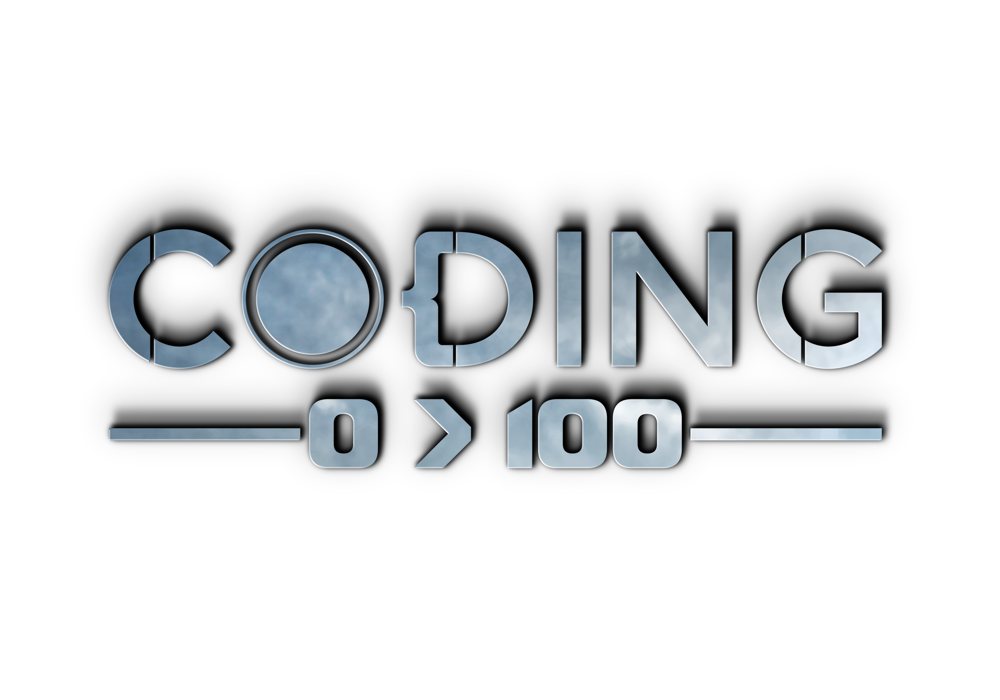

# Welcome to your Coding ZeroTo100 Introduction to Web Development

## Overview

At the end of this class, you will have the basic web development foundations to creating a website from scratch. You will have built and deployed a portfolio website from scratch that is beautiful on both big and small screens.

The skills you will have learned by the end of this class are:

- How to use the Command Line/Terminal
- Crafting a website layout using HTML
- Styling a website using CSS
- Leveraging third party CSS using Bootstrap
- Using third party fonts using Google Fonts
- Making a website look beautiful on both big and small screens (responsive) using CSS Flexbox and Media Queries
- Using Git version control
- Using GitHub to host your version controlled code
- Hosting static websites for free using GitHub Pages

## Extra Resources

- [Coding ZeroTo100 YouTube Channel](https://www.youtube.com/channel/UC9t-XaHAaBVQZqNJU27uIxw)
- [W3Schools](https://www.w3schools.com/)
- [FreeCodeCamp](https://www.freecodecamp.org/)

## Schedule

- [Module 1: Mastering the browser](./class-contents/mod-1-mastering-the-browser)

  - _Timeline_: Weeks 1-4
  - Slides:

    - [Intros, Fullstack Overview, CLI](https://docs.google.com/presentation/d/1aNLQ94jDu_QdJlmAArL4VhCR2eAdkTAyZgiKD6y8DAg/edit?usp=sharing)

    - [HTML & CSS](https://docs.google.com/presentation/d/1OChLHSaz5UrMJwuUJtSqDB3Y1wdbnZf_d8EHGl497-8/edit?usp=sharing)

    - [Responsive CSS](https://docs.google.com/presentation/d/1ueW7ILex_tRXPDsgMsBagEnT1zXGYyR5Z0cfGiDiWpY/edit?usp=sharing)

    - [Git & GitHub](https://docs.google.com/presentation/d/1t7_QTkl90RSp32XUVCCs_rT3YdghCTLr5YDKlxnjjwU/edit?usp=sharing)

    - [GitHub Pages & Review](https://docs.google.com/presentation/d/1WPxJ3bjGtnTC5l-6l3EYbLBvyPyDZtFWizdE_0XSoqs/edit?usp=sharing)

  - _Deliverables_:

    - [Personal portfolio](./class-contents/mod-1-mastering-the-browser/01-cmd-git-html-css/deliverables/personal-portfolio-project.md)
