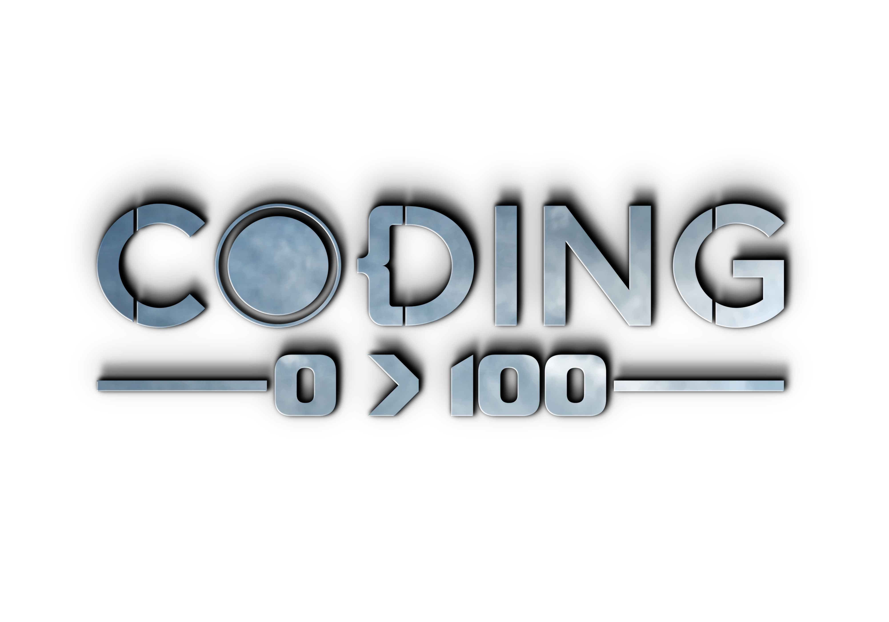

# Mastering the browser part 1: Building static web pages with HTML and CSS

## Outcomes:

- Feel comfortable navigating through files on your computer using the Terminal (Mac) or Command Line (Windows)
- Feel comfortable using most common presentational and semantic HTML tags
- Feel comfortable using the Chrome Dev Tools’s Console and Elements tabs to inspect and play around with DOM elements
- Feel comfortable applying stylesheets to HTML pages using inline or linked styles
- Feel comfortable making web pages responsive using media queries, flexbox, and Bootstrap CSS library
- Feel comfortable using most common git commands: `add`, `commit`, `push`, `clone`, and `pull`
- Feel comfortable hosting front-end projects using Github Pages

## Deliverable

[Homework 1: Personal portfolio](./deliverables/personal-portfolio-project.md)
